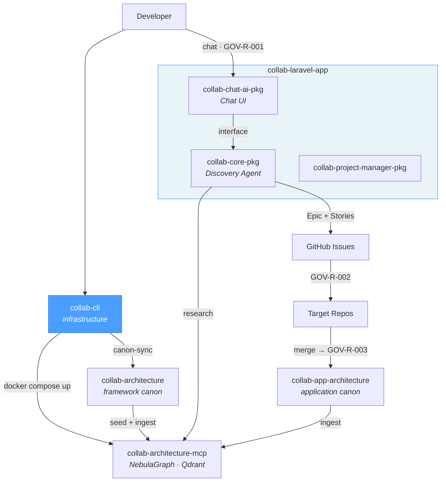

# collab-cli

Orchestration CLI for collaborative workflows with canonical architecture. Manages the complete lifecycle: from initial repository setup to Docker infrastructure, AI provider configuration, and architectural canon synchronization.

## Collab Ecosystem



| Repository | Role | Relation to this repo |
|------------|------|----------------------|
| [`collab-architecture`](https://github.com/uxmaltech/collab-architecture) | Framework canon | Framework-level rules, patterns, and governance |
| [`collab-app-architecture`](https://github.com/uxmaltech/collab-app-architecture) | Application canon | Application-specific rules, patterns, and decisions |
| **`collab-cli`** | **Orchestrator CLI** | **This repo — infrastructure CLI — canon sync, init, domain generation** |
| [`collab-architecture-mcp`](https://github.com/uxmaltech/collab-architecture-mcp) | MCP server | NebulaGraph + Qdrant — indexes canon for AI agents |
| [`collab-laravel-app`](https://github.com/uxmaltech/collab-laravel-app) | Host application | Laravel app that installs the ecosystem packages |
| [`collab-chat-ai-pkg`](https://github.com/uxmaltech/collab-chat-ai-pkg) | AI Chat package | Chat UI and prompt admin |
| [`collab-core-pkg`](https://github.com/uxmaltech/collab-core-pkg) | Issue orchestration | AI agent pipeline for issue creation |
| [`collab-project-manager-pkg`](https://github.com/uxmaltech/collab-project-manager-pkg) | Project manager | Project management functionality |

## Prerequisites

| Requirement | Version | Notes |
|-------------|---------|-------|
| Node.js | >= 20 | Required |
| npm | >= 10 | Required |
| git | any | Required for install script |
| Docker | any | Indexed mode only |

## Installation

**npm (global):**
```bash
npm install -g @uxmaltech/collab-cli
collab --version
```

**npx (ephemeral):**
```bash
npx @uxmaltech/collab-cli --help
```

**Installer script (latest-main):**
```bash
/bin/bash -c "$(curl -fsSL https://raw.githubusercontent.com/uxmaltech/collab-cli/main/install.sh)"
```

**Local development:**
```bash
npm install && npm run build
bin/collab --help
```

**Uninstall:**
```bash
/bin/bash -c "$(curl -fsSL https://raw.githubusercontent.com/uxmaltech/collab-cli/main/uninstall.sh)"
```

## Quick start

```bash
collab init                          # interactive wizard
collab init --yes                    # automatic mode (file-only, defaults)
collab init --yes --mode indexed     # automatic with Docker infrastructure
collab init --resume                 # resume from last failed stage
```

## Operation modes

| Aspect | File-only | Indexed |
|--------|-----------|---------|
| **Description** | Agents read `.md` files directly | Agents query NebulaGraph + Qdrant via MCP |
| **Docker** | Not required | Required (Qdrant, NebulaGraph, MCP server) |
| **MCP** | No | Yes — endpoint `http://127.0.0.1:7337/mcp` |
| **Wizard stages** | 8 | 14 |
| **Use case** | Small projects, no Docker, quick start | Multi-repo ecosystems, large canons |

**Transition heuristic:** Consider indexed mode when the canon exceeds ~50,000 tokens (~375 files).

## Commands

| Command | Description |
|---------|-------------|
| `collab init` | Onboarding wizard (complete setup) |
| `collab compose generate` | Generate docker-compose files (consolidated \| split) |
| `collab compose validate` | Validate compose files via `docker compose config` |
| `collab infra up\|down\|status` | Manage infrastructure services (Qdrant + NebulaGraph) |
| `collab mcp start\|stop\|status` | Manage MCP runtime service |
| `collab up` | Full startup pipeline (infra → MCP) |
| `collab seed` | Preflight check for infrastructure before seeding |
| `collab doctor` | System diagnostics: config, health, and versions |
| `collab update-canons` | Download/update canon from GitHub |

## Global options

| Option | Description |
|--------|-------------|
| `--cwd <path>` | Working directory for collab operations |
| `--dry-run` | Preview actions without side effects |
| `--verbose` | Detailed command logging |
| `--quiet` | Reduce output to results and errors only |
| `-v, --version` | Show CLI version |

## AI providers

| Provider | Env var | CLI detection | Default models |
|----------|---------|---------------|----------------|
| Codex (OpenAI) | `OPENAI_API_KEY` | `codex` | o3-pro, gpt-4.1, o4-mini |
| Claude (Anthropic) | `ANTHROPIC_API_KEY` | `claude` | claude-sonnet-4, claude-opus-4 |
| Gemini (Google) | `GOOGLE_AI_API_KEY` | `gemini` | gemini-2.5-pro, gemini-2.5-flash |
| Copilot (GitHub) | — | `gh` | GitHub Copilot backend |

**Auto-detection:** Providers are detected automatically if their env var is set or their CLI is in PATH.

**MCP snippets:** During `collab init`, MCP configuration files are generated per provider (`claude-mcp-config.json`, `gemini-mcp-config.json`) to connect agents to the MCP server.

## Wizard pipeline (`collab init`)

### File-only (8 stages)

1. Preflight checks (docker, node, npm, git)
2. Environment setup (`.collab/config.json`)
3. Assistant setup (AI provider configuration)
4. Canon sync (download collab-architecture from GitHub)
5. Repo scaffold (`docs/architecture` and `docs/ai` structure)
6. Repo analysis (basic structure and dependency analysis)
7. CI setup (GitHub Actions templates)
8. Agent skills setup (skills and prompts registration)

### Indexed (14 stages)

**Phase A — Local setup (stages 1-8):** Same as file-only, but repo analysis uses AI.

**Phase B — Infrastructure (stages 9-11):**

9. Compose generation (docker-compose.yml or split files)
10. Infra startup (Qdrant + NebulaGraph via Docker)
11. MCP startup (MCP service + health checks)

**Phase C — Ingestion (stages 12-14):**

12. MCP client config (provider snippets)
13. Graph seeding (initialize graph with architecture data)
14. Canon ingest (ingest collab-architecture into Qdrant/Nebula)

**Useful flags:**
- `--resume` — resume from last incomplete stage
- `--force` — overwrite existing config
- `--skip-analysis` — skip code analysis
- `--skip-ci` — skip CI generation
- `--providers codex,claude` — specify providers

## Workspace mode

For multi-repo ecosystems, collab-cli automatically detects the workspace root and allows repository selection:

```bash
collab init --repos repo-a,repo-b,repo-c
```

When run from a directory containing multiple repos, the wizard presents repository selection interactively.

## Local development

| Script | Description |
|--------|-------------|
| `npm run build` | Compile TypeScript to `dist/` |
| `npm run lint` | ESLint on `src/**/*.ts` |
| `npm run format` | Prettier (check) |
| `npm run format:write` | Prettier (write) |
| `npm test` | Build + run tests |
| `npm run test:e2e` | E2E with Docker (`collab init --mode indexed` → MCP tool call) |
| `npm run typecheck` | TypeScript without emit |
| `npm run pack:dry-run` | Verify npm package contents |

## Project structure

```
bin/                     # executable entrypoint (bin/collab)
src/
  cli.ts                 # main entry point, registers commands
  commands/              # command hierarchy (init, compose, infra, mcp, up, seed, doctor)
  lib/                   # shared utilities (config, orchestrator, health, providers, executor)
  stages/                # pipeline stages (preflight, canon-sync, repo-analysis, graph-seed...)
  templates/             # compose and CI templates
tests/                   # integration and orchestration tests
scripts/                 # auxiliary scripts (test runner)
docs/
  release.md             # distribution and versioning strategy
  ai/                    # AI agent context (brief, domain map, module map)
  architecture/          # architectural knowledge
ecosystem.manifest.json  # cross-repo compatibility ranges
```

## Governance and releases

- [CONTRIBUTING](CONTRIBUTING.md) — contribution rules and language policy
- [Release strategy](docs/release.md) — distribution, SemVer, CI pinning, rollback

## License

MIT
