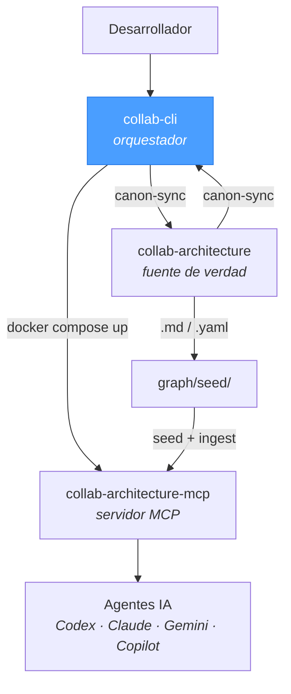

# collab-cli

CLI de orquestación para workflows colaborativos con arquitectura canónica. Gestiona el ciclo completo: desde el setup inicial de un repositorio hasta la infraestructura Docker, configuración de proveedores IA, y sincronización del canon arquitectónico.

## Ecosistema Collab



| Repositorio | Rol | Relación con este repo |
|-------------|-----|----------------------|
| **`collab-cli`** | **Orquestador CLI** | **Este repo — interfaz de usuario que orquesta todo** |
| [`collab-architecture`](https://github.com/uxmaltech/collab-architecture) | Fuente de verdad | Provee reglas, patrones y decisiones canónicas |
| [`collab-architecture-mcp`](https://github.com/uxmaltech/collab-architecture-mcp) | Servidor MCP | Expone el canon como grafo + vectores a los agentes IA |

## Requisitos previos

| Requisito | Versión | Notas |
|-----------|---------|-------|
| Node.js | >= 20 | Requerido |
| npm | >= 10 | Requerido |
| git | cualquiera | Requerido para install script |
| Docker | cualquiera | Solo modo indexed |

## Instalación

**npm (global):**
```bash
npm install -g @uxmaltech/collab-cli
collab --version
```

**npx (efímero):**
```bash
npx @uxmaltech/collab-cli --help
```

**Installer script (latest-main):**
```bash
/bin/bash -c "$(curl -fsSL https://raw.githubusercontent.com/uxmaltech/collab-cli/main/install.sh)"
```

**Desarrollo local:**
```bash
npm install && npm run build
bin/collab --help
```

**Desinstalar:**
```bash
/bin/bash -c "$(curl -fsSL https://raw.githubusercontent.com/uxmaltech/collab-cli/main/uninstall.sh)"
```

## Inicio rápido

```bash
collab init                          # wizard interactivo
collab init --yes                    # modo automático (file-only, defaults)
collab init --yes --mode indexed     # automático con infraestructura Docker
collab init --resume                 # retomar desde la última etapa fallida
```

## Modos de operación

| Aspecto | File-only | Indexed |
|---------|-----------|---------|
| **Descripción** | Agentes leen `.md` directamente | Agentes consultan NebulaGraph + Qdrant vía MCP |
| **Docker** | No requerido | Requerido (Qdrant, NebulaGraph, MCP server) |
| **MCP** | No | Sí — endpoint `http://127.0.0.1:7337/mcp` |
| **Etapas del wizard** | 8 | 14 |
| **Caso de uso** | Proyectos pequeños, sin Docker, inicio rápido | Ecosistemas multi-repo, canons grandes |

**Heurística de transición:** Considerar modo indexed cuando el canon supera ~50,000 tokens (~375 archivos).

## Comandos

| Comando | Descripción |
|---------|-------------|
| `collab init` | Wizard de onboarding (setup completo) |
| `collab compose generate` | Generar archivos docker-compose (consolidated \| split) |
| `collab compose validate` | Validar archivos compose via `docker compose config` |
| `collab infra up\|down\|status` | Gestionar servicios de infraestructura (Qdrant + NebulaGraph) |
| `collab mcp start\|stop\|status` | Gestionar servicio MCP runtime |
| `collab up` | Pipeline completo de startup (infra → MCP) |
| `collab seed` | Preflight check de infraestructura antes de seeding |
| `collab doctor` | Diagnóstico del sistema, config, salud y versiones |
| `collab update-canons` | Descargar/actualizar canon desde GitHub |

## Opciones globales

| Opción | Descripción |
|--------|-------------|
| `--cwd <path>` | Directorio de trabajo para operaciones collab |
| `--dry-run` | Preview de acciones sin efectos secundarios |
| `--verbose` | Logging detallado de comandos |
| `--quiet` | Reducir output a resultados y errores |
| `-v, --version` | Mostrar versión del CLI |

## Proveedores IA

| Provider | Env var | Detección CLI | Modelos default |
|----------|---------|---------------|-----------------|
| Codex (OpenAI) | `OPENAI_API_KEY` | `codex` | o3-pro, gpt-4.1, o4-mini |
| Claude (Anthropic) | `ANTHROPIC_API_KEY` | `claude` | claude-sonnet-4, claude-opus-4 |
| Gemini (Google) | `GOOGLE_AI_API_KEY` | `gemini` | gemini-2.5-pro, gemini-2.5-flash |
| Copilot (GitHub) | — | `gh` | Backend de GitHub Copilot |

**Auto-detección:** Los providers se detectan automáticamente si su env var está configurada o su CLI está en PATH.

**Snippets MCP:** Durante `collab init`, se generan archivos de configuración MCP por provider (`claude-mcp-config.json`, `gemini-mcp-config.json`) para conectar agentes al servidor MCP.

## Pipeline del wizard (`collab init`)

### File-only (8 etapas)

1. Preflight checks (docker, node, npm, git)
2. Environment setup (`.collab/config.json`)
3. Assistant setup (configuración de providers IA)
4. Canon sync (descarga collab-architecture desde GitHub)
5. Repo scaffold (estructura `docs/architecture` y `docs/ai`)
6. Repo analysis (análisis básico de estructura y dependencias)
7. CI setup (templates GitHub Actions)
8. Agent skills setup (registro de skills y prompts)

### Indexed (14 etapas)

**Fase A — Setup local (etapas 1-8):** Igual que file-only, pero el análisis de repo usa IA.

**Fase B — Infraestructura (etapas 9-11):**

9. Compose generation (docker-compose.yml o archivos split)
10. Infra startup (Qdrant + NebulaGraph via Docker)
11. MCP startup (servicio MCP + health checks)

**Fase C — Ingestion (etapas 12-14):**

12. MCP client config (snippets para providers)
13. Graph seeding (inicializar grafo con datos de arquitectura)
14. Canon ingest (ingestar collab-architecture en Qdrant/Nebula)

**Flags útiles:**
- `--resume` — retomar desde la última etapa incompleta
- `--force` — sobreescribir config existente
- `--skip-analysis` — saltar análisis de código
- `--skip-ci` — saltar generación de CI
- `--providers codex,claude` — especificar providers

## Modo workspace

Para ecosistemas multi-repo, collab-cli detecta automáticamente la raíz del workspace y permite seleccionar repositorios:

```bash
collab init --repos repo-a,repo-b,repo-c
```

Cuando se ejecuta desde un directorio que contiene múltiples repos, el wizard presenta la selección de repositorios interactivamente.

## Desarrollo local

| Script | Descripción |
|--------|-------------|
| `npm run build` | Compilar TypeScript a `dist/` |
| `npm run lint` | ESLint sobre `src/**/*.ts` |
| `npm run format` | Prettier (check) |
| `npm run format:write` | Prettier (escribir) |
| `npm test` | Build + ejecutar tests |
| `npm run test:e2e` | E2E con Docker (`collab init --mode indexed` → MCP tool call) |
| `npm run typecheck` | TypeScript sin emit |
| `npm run pack:dry-run` | Verificar contenido del paquete npm |

## Estructura del proyecto

```
bin/                     # entrypoint ejecutable (bin/collab)
src/
  cli.ts                 # entry point principal, registra comandos
  commands/              # jerarquía de comandos (init, compose, infra, mcp, up, seed, doctor)
  lib/                   # utilidades compartidas (config, orchestrator, health, providers, executor)
  stages/                # etapas del pipeline (preflight, canon-sync, repo-analysis, graph-seed...)
  templates/             # templates de compose y CI
tests/                   # tests de integración y orquestación
scripts/                 # scripts auxiliares (test runner)
docs/
  release.md             # estrategia de distribución y versioning
  ai/                    # contexto para agentes IA (brief, domain map, module map)
  architecture/          # conocimiento arquitectónico
ecosystem.manifest.json  # rangos de compatibilidad cross-repo
```

## Gobernanza y releases

- [CONTRIBUTING](CONTRIBUTING.md) — reglas de contribución y política de idioma
- [Release strategy](docs/release.md) — distribución, SemVer, CI pinning, rollback

## Licencia

MIT
