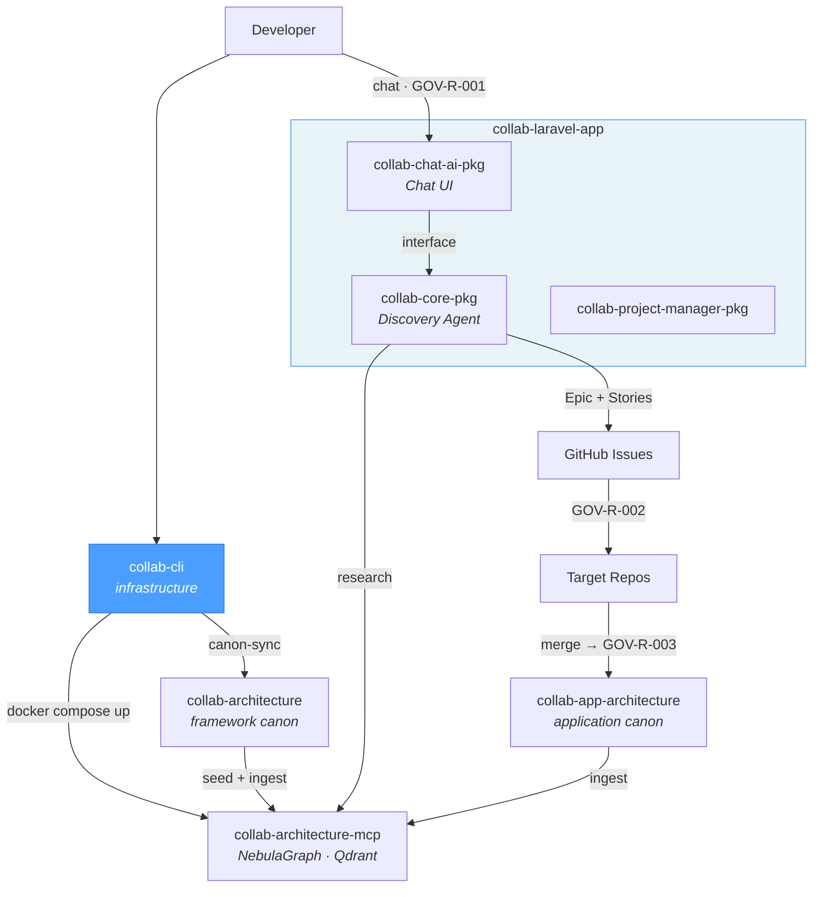
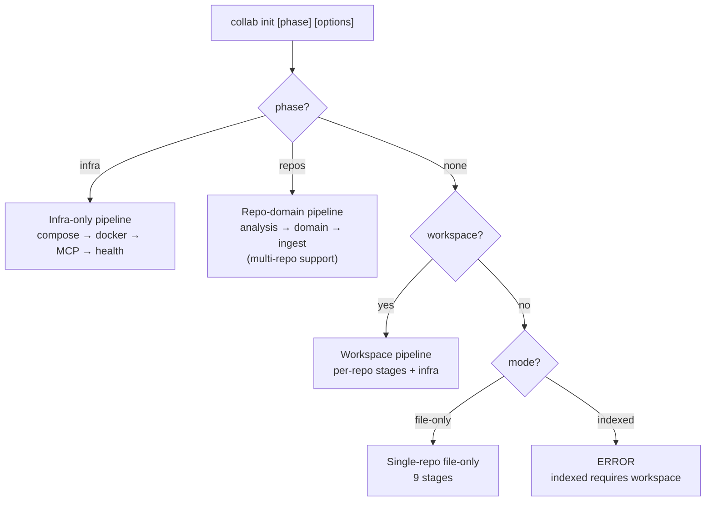
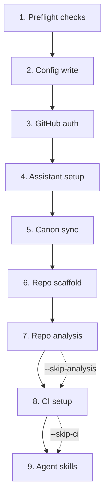
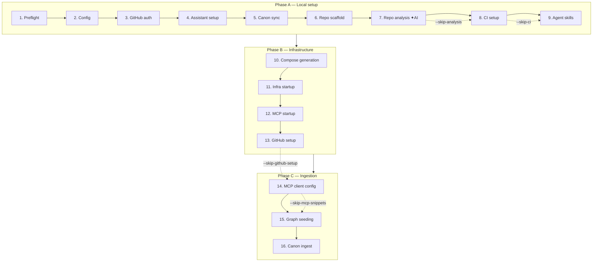
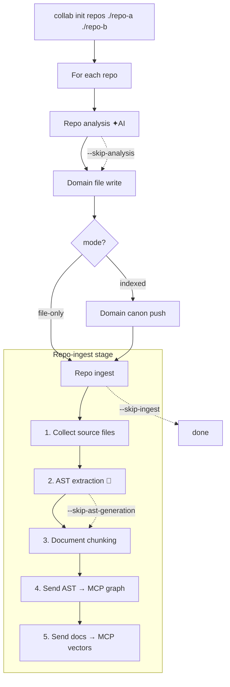
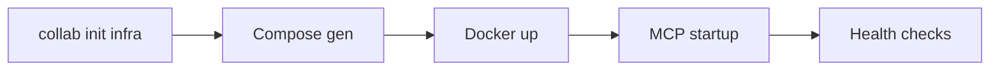
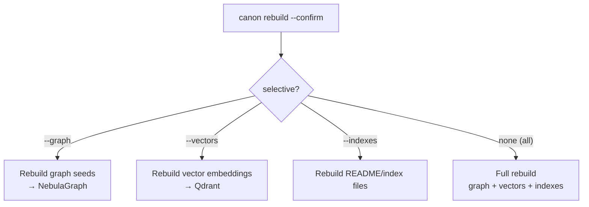
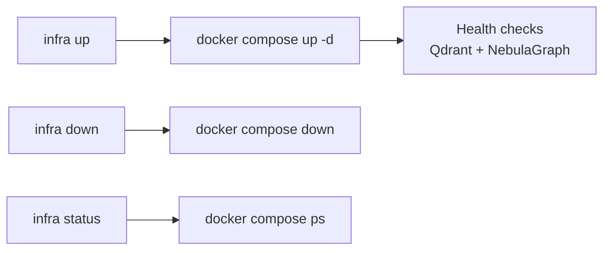
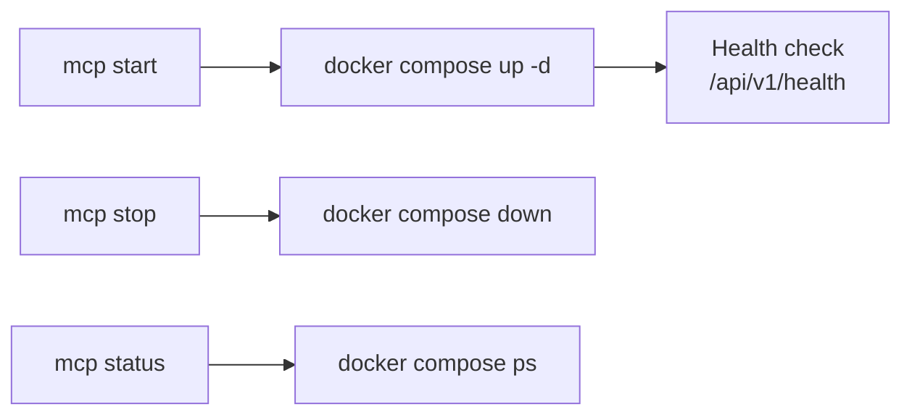
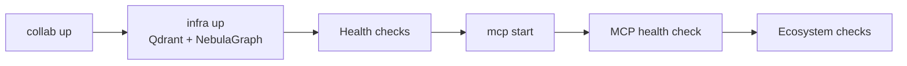

# collab-cli

Orchestration CLI for collaborative workflows with canonical architecture. Manages the complete lifecycle: from initial repository setup to Docker infrastructure, AI provider configuration, and architectural canon synchronization.

## Collab Ecosystem



| Repository | Role | Relation to this repo |
|------------|------|----------------------|
| [`collab-architecture`](https://github.com/uxmaltech/collab-architecture) | Framework canon | Framework-level rules, patterns, and governance |
| [`collab-app-architecture`](https://github.com/uxmaltech/collab-app-architecture) | Application canon | Application-specific rules, patterns, and decisions |
| **`collab-cli`** | **Orchestrator CLI** | **This repo — infrastructure CLI — canon sync, init, domain generation** |
| [`collab-architecture-mcp`](https://github.com/uxmaltech/collab-architecture-mcp) | MCP server | NebulaGraph + Qdrant — indexes canon for AI agents |
| [`collab-laravel-app`](https://github.com/uxmaltech/collab-laravel-app) | Host application | Laravel app that installs the ecosystem packages |
| [`collab-chat-ai-pkg`](https://github.com/uxmaltech/collab-chat-ai-pkg) | AI Chat package | Chat UI and prompt admin |
| [`collab-core-pkg`](https://github.com/uxmaltech/collab-core-pkg) | Issue orchestration | AI agent pipeline for issue creation |
| [`collab-project-manager-pkg`](https://github.com/uxmaltech/collab-project-manager-pkg) | Project manager | Project management functionality |

## Prerequisites

| Requirement | Version | Notes |
|-------------|---------|-------|
| Node.js | >= 20 | Required |
| npm | >= 10 | Required |
| git | any | Required for install script |
| Docker | any | Indexed mode only |

## Installation

**npm (global):**
```bash
npm install -g @uxmaltech/collab-cli
collab --version
```

**npx (ephemeral):**
```bash
npx @uxmaltech/collab-cli --help
```

**Installer script (latest-main):**
```bash
/bin/bash -c "$(curl -fsSL https://raw.githubusercontent.com/uxmaltech/collab-cli/main/install.sh)"
```

**Local development:**
```bash
npm install && npm run build
bin/collab --help
```

**Uninstall:**
```bash
/bin/bash -c "$(curl -fsSL https://raw.githubusercontent.com/uxmaltech/collab-cli/main/uninstall.sh)"
```

## Quick start

```bash
collab init                          # interactive wizard
collab init --yes                    # automatic mode (file-only, defaults)
collab init --yes --mode indexed     # automatic with Docker infrastructure
collab init --resume                 # resume from last failed stage
```

## Operation modes

| Aspect | File-only | Indexed |
|--------|-----------|---------|
| **Description** | Agents read `.md` files directly | Agents query NebulaGraph + Qdrant via MCP |
| **Docker** | Not required | Required (Qdrant, NebulaGraph, MCP server) |
| **MCP** | No | Yes — endpoint `http://127.0.0.1:7337/mcp` |
| **Wizard stages** | 9 | 16 |
| **Use case** | Small projects, no Docker, quick start | Multi-repo ecosystems, large canons |

**Transition heuristic:** Consider indexed mode when the canon exceeds ~50,000 tokens (~375 files).

## AI providers

| Provider | Env var | CLI detection | Default models |
|----------|---------|---------------|----------------|
| Codex (OpenAI) | `OPENAI_API_KEY` | `codex` | o3-pro, gpt-4.1, o4-mini |
| Claude (Anthropic) | `ANTHROPIC_API_KEY` | `claude` | claude-sonnet-4, claude-opus-4 |
| Gemini (Google) | `GOOGLE_AI_API_KEY` | `gemini` | gemini-2.5-pro, gemini-2.5-flash |
| Copilot (GitHub) | — | `gh` | GitHub Copilot backend |

**Auto-detection:** Providers are detected automatically if their env var is set or their CLI is in PATH.

**MCP snippets:** During `collab init`, MCP configuration files are generated per provider (`claude-mcp-config.json`, `gemini-mcp-config.json`) to connect agents to the MCP server.

---

## CLI Reference

### Global options

These options are available on **all** commands:

| Option | Description |
|--------|-------------|
| `--cwd <path>` | Working directory for collab operations |
| `--dry-run` | Preview actions without side effects |
| `--verbose` | Detailed command logging |
| `--quiet` | Reduce output to results and errors only |
| `-v, --version` | Show CLI version |
| `-h, --help` | Display help for any command |

---

### `collab init`

Run the onboarding wizard and orchestrate setup stages.

```bash
collab init [phase] [options]
```

#### Command routing



#### Full wizard pipeline — file-only (9 stages)



#### Full wizard pipeline — indexed (16 stages)



#### Domain generation (`collab init repos`)

Scan one or more repository paths and generate their domain definitions. Supports multi-repo batch processing:

```bash
collab init repos <path> --mode file-only --yes --business-canon none
collab init repos <path> --mode indexed --business-canon owner/repo
collab init repos ./repo-a ./repo-b ./repo-c --mode file-only --yes --business-canon none
collab init repos <path> --skip-analysis          # skip AI analysis
collab init repos <path> --skip-ingest            # skip entire ingest stage
collab init repos <path> --skip-ast-generation    # skip tree-sitter, still ingest docs
```



**`--skip-*` flag behavior with `repos`:**

| `--skip-ast-generation` | `--skip-ingest` | Result |
|---|---|---|
| ❌ | ❌ | Full pipeline: extract AST + chunk docs + send both to MCP |
| ✅ | ❌ | Skip tree-sitter, still chunk docs and send markdown to MCP |
| ❌ | ✅ | Skip entire ingest stage — no extraction, no MCP send |
| ✅ | ✅ | Same as `--skip-ingest` alone |

#### Infrastructure only (`collab init infra`)

```bash
collab init infra                  # run infra pipeline
collab init infra --resume         # resume from last incomplete stage
```



#### All `collab init` options

| Option | Description |
|--------|-------------|
| `-f, --force` | Overwrite existing `.collab/config.json` |
| `--yes` | Accept defaults and run non-interactively |
| `--resume` | Resume from the last incomplete stage |
| `--mode <mode>` | Wizard mode: `file-only` \| `indexed` |
| `--compose-mode <mode>` | Compose mode: `consolidated` \| `split` |
| `--infra-type <type>` | Infrastructure: `local` \| `remote` (indexed only) |
| `--mcp-url <url>` | MCP server base URL for remote infrastructure |
| `--output-dir <dir>` | Directory for compose outputs |
| `--repos <list>` | Comma-separated repo directories for workspace mode |
| `--repo <package>` | **(deprecated)** Use `collab init repos <path>` instead |
| `--skip-mcp-snippets` | Skip MCP client config snippet generation |
| `--skip-analysis` | Skip AI-powered repository analysis (codex/claude/gemini) |
| `--skip-ci` | Skip GitHub Actions CI workflow generation |
| `--skip-github-setup` | Skip GitHub branch model and workflow configuration |
| `--skip-ingest` | Skip entire repo-ingest stage (no AST, no MCP ingestion) |
| `--skip-ast-generation` | Skip tree-sitter AST extraction (documents still chunked and ingested) |
| `--providers <list>` | Comma-separated AI providers: `codex,claude,gemini,copilot` |
| `--business-canon <value>` | Business canon: `owner/repo`, `/local/path`, or `none` |
| `--github-token <token>` | GitHub token for non-interactive mode |
| `--timeout-ms <ms>` | Per-check timeout in milliseconds (default: `5000`) |
| `--retries <count>` | Health check retries (default: `15`) |
| `--retry-delay-ms <ms>` | Delay between retries in milliseconds (default: `2000`) |

---

### `collab canon rebuild`

Destroy and recreate all derived canon artifacts for the current workspace.

```bash
collab canon rebuild --confirm          # full rebuild
collab canon rebuild --confirm --graph  # only rebuild graph seeds
collab canon rebuild --confirm --vectors # only rebuild vector embeddings
collab canon rebuild --confirm --indexes # only rebuild README/index files
collab canon rebuild --dry-run --confirm # preview without executing
```



| Option | Description |
|--------|-------------|
| `--confirm` | Required flag to confirm destructive rebuild |
| `--graph` | Only rebuild graph seeds via MCP |
| `--vectors` | Only rebuild vector embeddings |
| `--indexes` | Only rebuild README/index files |

---

### `collab compose generate`

Generate Docker Compose templates for collab services.

```bash
collab compose generate                         # consolidated (default)
collab compose generate --mode split            # split per-service files
collab compose generate --output my-compose.yml # custom output path
collab compose generate --env-file .env.local   # environment overrides
```

| Option | Description |
|--------|-------------|
| `--mode <mode>` | Generation mode: `consolidated` \| `split` (default: `consolidated`) |
| `--output <file>` | Output path for consolidated mode |
| `--output-dir <dir>` | Output directory for generated compose files |
| `--env-file <file>` | Path to environment override file |
| `--skip-validate` | Skip docker compose validation after generation |

### `collab compose validate`

Validate generated Docker Compose files via `docker compose config`.

```bash
collab compose validate                     # auto-detect mode
collab compose validate --mode consolidated # explicit mode
collab compose validate --file a.yml b.yml  # specific files
```

| Option | Description |
|--------|-------------|
| `--mode <mode>` | Validation mode: `auto` \| `consolidated` \| `split` (default: `auto`) |
| `--file <path...>` | Explicit compose files to validate |
| `--output-dir <dir>` | Compose directory when using mode selection |

---

### `collab infra up|down|status`

Manage infrastructure services (Qdrant + NebulaGraph via Docker).

```bash
collab infra up                     # start infrastructure + wait for health
collab infra up --timeout-ms 10000  # custom health check timeout
collab infra down                   # stop infrastructure services
collab infra status                 # show service status
```



**`infra up` options:**

| Option | Description |
|--------|-------------|
| `--file <path>` | Compose file to use |
| `--output-dir <dir>` | Directory to locate generated compose files |
| `--timeout-ms <ms>` | Per-check timeout in milliseconds (default: `5000`) |
| `--retries <count>` | Health check retries (default: `15`) |
| `--retry-delay-ms <ms>` | Delay between retries in milliseconds (default: `2000`) |

**`infra down` / `infra status` options:**

| Option | Description |
|--------|-------------|
| `--file <path>` | Compose file to use |
| `--output-dir <dir>` | Directory to locate generated compose files |

---

### `collab mcp start|stop|status`

Manage MCP runtime service lifecycle.

```bash
collab mcp start                    # start MCP service + health check
collab mcp stop                     # stop MCP service
collab mcp status                   # show MCP service status
```



**`mcp start` options:**

| Option | Description |
|--------|-------------|
| `--file <path>` | Compose file to use |
| `--output-dir <dir>` | Directory to locate generated compose files |
| `--timeout-ms <ms>` | Per-check timeout in milliseconds (default: `5000`) |
| `--retries <count>` | Health check retries (default: `15`) |
| `--retry-delay-ms <ms>` | Delay between retries in milliseconds (default: `2000`) |

**`mcp stop` / `mcp status` options:**

| Option | Description |
|--------|-------------|
| `--file <path>` | Compose file to use |
| `--output-dir <dir>` | Directory to locate generated compose files |

---

### `collab up`

Run the full startup pipeline: infrastructure → MCP.

```bash
collab up                          # start everything
collab up --mode indexed           # explicit mode
collab up --resume                 # resume from last incomplete stage
```



| Option | Description |
|--------|-------------|
| `--mode <mode>` | Execution mode: `file-only` \| `indexed` |
| `--file <path>` | Compose file for infra and MCP |
| `--output-dir <dir>` | Directory to locate generated compose files |
| `--timeout-ms <ms>` | Per-check timeout in milliseconds (default: `5000`) |
| `--retries <count>` | Health check retries (default: `15`) |
| `--retry-delay-ms <ms>` | Delay between retries in milliseconds (default: `2000`) |
| `--resume` | Resume from last incomplete stage |

---

### `collab seed`

Run a baseline infrastructure readiness check before seeding data.

```bash
collab seed                        # preflight check
collab seed --dry-run              # preview without executing
```

| Option | Description |
|--------|-------------|
| `--file <path>` | Compose file to use |
| `--output-dir <dir>` | Directory to locate generated compose files |
| `--dry-run` | Print the seed preflight command without executing |

---

### `collab doctor`

Run diagnostics across system, infrastructure, MCP, configuration, and versions.

```bash
collab doctor                      # full diagnostic report
collab doctor --verbose            # detailed output
```

Checks performed: Node.js, npm, git, Docker daemon, Docker images, `.env` file, compose files, Qdrant health, NebulaGraph health, MCP health, ecosystem compatibility.

No command-specific options. Uses global options only.

---

### `collab update-canons`

Download or update collab-architecture and business canons from GitHub.

```bash
collab update-canons               # sync canons
collab update-canons --dry-run     # preview without syncing
```

No command-specific options. Uses global options only.

---

### `collab upgrade`

Check for and install the latest version of collab-cli.

```bash
collab upgrade                     # check and install latest version
collab upgrade --check             # check only, do not install
```

| Option | Description |
|--------|-------------|
| `--check` | Only check for updates without installing |

---

### `collab uninstall`

Uninstall collab-cli from the system.

```bash
collab uninstall                   # interactive confirmation
collab uninstall --yes             # skip confirmation prompt
```

| Option | Description |
|--------|-------------|
| `--yes` | Skip confirmation prompt |

---

## Workspace mode

For multi-repo ecosystems, collab-cli automatically detects the workspace root and allows repository selection:

```bash
collab init --repos repo-a,repo-b,repo-c
```

When run from a directory containing multiple repos, the wizard presents repository selection interactively.

## Local development

| Script | Description |
|--------|-------------|
| `npm run build` | Compile TypeScript to `dist/` |
| `npm run lint` | ESLint on `src/**/*.ts` |
| `npm run format` | Prettier (check) |
| `npm run format:write` | Prettier (write) |
| `npm test` | Build + run tests |
| `npm run test:e2e` | E2E with Docker (`collab init --mode indexed` → MCP tool call) |
| `npm run typecheck` | TypeScript without emit |
| `npm run pack:dry-run` | Verify npm package contents |

## Project structure

```
bin/                     # executable entrypoint (bin/collab)
src/
  cli.ts                 # main entry point, registers commands
  commands/              # command hierarchy (init, compose, infra, mcp, up, seed, doctor)
  lib/                   # shared utilities (config, orchestrator, health, providers, executor)
  stages/                # pipeline stages (preflight, canon-sync, repo-analysis, graph-seed...)
  templates/             # compose and CI templates
queries/                 # tree-sitter query files for AST extraction (PHP, TypeScript)
tests/                   # integration and orchestration tests
scripts/                 # auxiliary scripts (test runner)
docs/
  release.md             # distribution and versioning strategy
  ai/                    # AI agent context (brief, domain map, module map)
  architecture/          # architectural knowledge
ecosystem.manifest.json  # cross-repo compatibility ranges
```

## Governance and releases

- [CONTRIBUTING](CONTRIBUTING.md) — contribution rules and language policy
- [Release strategy](docs/release.md) — distribution, SemVer, CI pinning, rollback

## License

MIT
